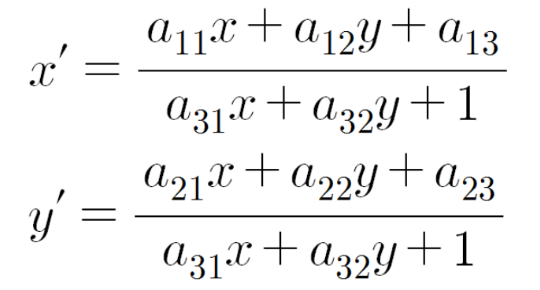

# **Nonlinear Data Fitting**

### **Task:**
Model: 2D transformation between given images (C++ implementation)

1. Establish the feature correspondence between the two images. (Output: xi, yi, xi', yi', i=1~N)
2. Find the parameters using the correspondence data.

 

### **Compilation Method**

The following file is compiled using G++ with the following input at command prompt.

File: hw10.cpp
    
    g++ hw10.cpp -o hw10 `pkg-config --cflags --libs opencv4`

The compiled code can be executed with the 

    ./hw10