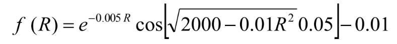

# **Root Finding II**

### **Task:**
Find the root of f(R)=0 and the number of iterations
when the r.e.=10-4 and 10-6 respectively.

 

### **Compilation Method**

The following file is compiled using GCC with the following input at command prompt.

File: hw4.c

    gcc -o hw4 hw4.c -lm
