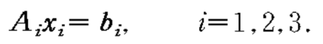

# **Linear Equations I**

### **Task:**
Solve the following set of equations

using
1. Gauss-Jordan Elimination (gaussj())
2. LU Decomposition (ludcmp())
3. Singular Value Decomposition (svdcmp())

 

### **Compilation Method**

All files are compiled using GCC with the following input at command prompt.

File: svdcmp.c, nrutil.c, pythag.c, svbksb.c, ludcmp.c, mprove.c, gaussj.c

    gcc -Wall -c svdcmp.c
    gcc -Wall -c nrutil.c
    gcc -Wall -c pythag.c
    gcc -Wall -c svbksb.c
    gcc -Wall -c ludcmp.c
    gcc -Wall -c lubksb.c
    gcc -Wall -c mprove.c
    gcc -Wall -c gaussj.c

Q1) i = 1

    gcc -Wall -c hw5_q1.c
    gcc -o q1 hw5_q1.o svdcmp.o nrutil.o pythag.o svbksb.o ludcmp.o lubksb.o mprove.o -lm 

Q2) i = 2
    
    gcc -Wall -c hw5_q2.c
    gcc -o q2 hw5_q2.o svdcmp.o nrutil.o pythag.o svbksb.o ludcmp.o lubksb.o mprove.o gaussj.o -lm 

Q3) i = 3

    gcc -Wall -c hw5_q3.c
    gcc -o q3 hw5_q3.o svdcmp.o nrutil.o pythag.o svbksb.o ludcmp.o lubksb.o mprove.o gaussj.o -lm

The compiled codes can be executed with the respective format in command prompt.

    ./q1
    ./q2
    ./q3