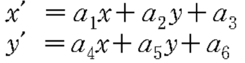

# **Linear Data Fitting**

### **Task:**
Given N observations (xi, yi, xi, yi), i = 1, 2, ..., N and a linear mapping model:

Find the best (in the least-square sense) set of parameters **a** = (a1, ..., a6) that fits the given data.

 

### **Compilation Method**

The following file is compiled using GCC with the following input at command prompt.

File: hw9.c

    gcc -c hw9.c
    gcc -o hw9 hw9.o

The compiled code can be executed with the respective format in command prompt.

    ./hw9